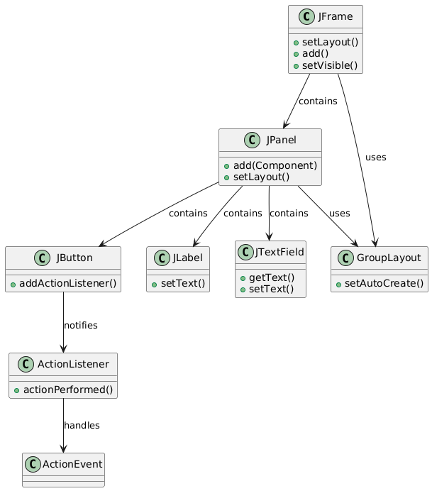

Q1.
We did some investigating into the swing framework and found out that the swing framework is a GUI (graphical user interface) toolkit for java. It provides a lot of prebuilt components like buttons, text, fields and labels. We also found out that it uses an MVC pattern where it separates the model, view and input allowing the app to be program data independent.

Q2.
The example code in the Github repository implements a simple version of the MVC pattern where the model stores only the data through basic gets and sets, the view shows the basic swing components and layouts and where the controller connects them together by handling user input through action events. This differs from the MVC pattern we see in the lectures because it does not use an observer approach between the view and the model like we see in the lecture examples. This makes the github pattern less modular and more tightly coupled without any interfaces and module patterns. 

